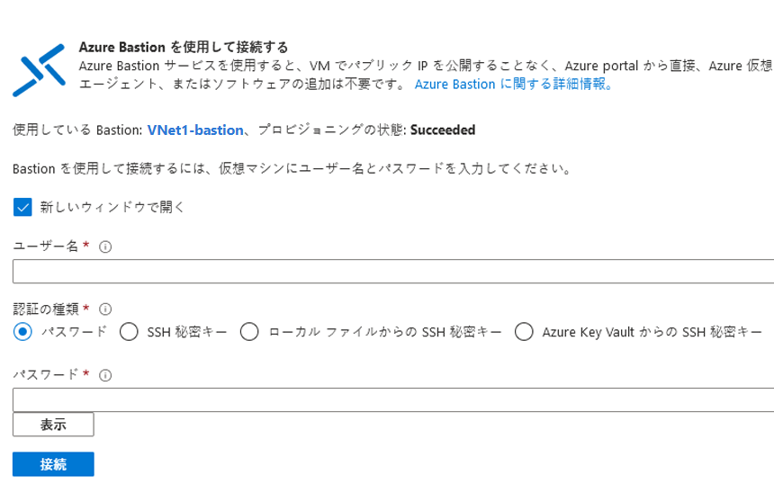

# デモンストレーション: Azure Bastion を使って Linux VM への SSH 接続を作成する

このデモでは、Azure portal とユーザー名とパスワードを使用して、Azure 仮想ネットワークにある Linux VM への SSH 接続を作成します。 Azure Bastion を使用する場合、VM にクライアント、エージェント、追加のソフトウェアは不要です。

## 前提条件

このデモを完了するには、Linux VM を含む Azure 仮想ネットワークが必要です。 Azure VM を作成する方法の詳細については、「[デモ: ポータルで仮想マシンを作成する](https://github.com/MicrosoftLearning/AZ-120-Planning-and-Administering-Microsoft-Azure-for-SAP-Workloads/blob/master/Demos/demo-create-virtual-machine-portal.md)」または「[デモ: PowerShell で仮想スイッチを作成する](https://github.com/MicrosoftLearning/AZ-120-Planning-and-Administering-Microsoft-Azure-for-SAP-Workloads/blob/master/Demos/demo-create-virtual-machine-powershell.md)」を参照してください。

VM が存在する仮想ネットワークの Azure Bastion ホストが設定されていることを確認します。 詳細については、[Azure Bastion ホストの作成](https://docs.microsoft.com/azure/bastion/tutorial-create-host-portal)に関する記事をご覧ください。 Bastion サービスをプロビジョニングし、仮想ネットワークにデプロイしたら、それを使用してこの仮想ネットワーク内の任意の VM に接続できます。 

### 必要なロール

接続を作成するには、次のロールが必要です。

* 仮想マシンに対する閲覧者ロール
* 仮想マシンのプライベート IP を使用する NIC に対する閲覧者ロール
* Azure Bastion リソースに対する閲覧者ロール

### Port

SSH 経由で Linux VM に接続するには、お使いの VM で次のポートを開いておく必要があります。

* 受信ポート: SSH (22) ***または***
* 受信ポート: カスタム値 (Azure Bastion 経由で VM に接続するときに、このカスタム ポートを指定する必要がある)

> **注:**  カスタム ポート値を指定する場合は、Standard SKU を使用して Azure Bastion を構成する必要があります。 Basic SKU では、カスタム ポートを指定できません。 Standard SKU は現在プレビュー段階です。

## 接続: ユーザー名とパスワードを使用する

1. [Azure Portal](https://portal.azure.com)を開きます。 接続する仮想マシンに移動し、 **[接続]** を選択して、ドロップダウンから **[Bastion]** を選択します。

    ![Azure portal の仮想マシンの概要を示すスクリーンショット。[接続] が選ばれています。](Images/azure-bastion-connect.png)

1. **[Bastion を使用する]** を選択します。 Bastion を仮想ネットワーク用にプロビジョニングしていない場合は、[Bastion の構成](https://docs.microsoft.com/azure/bastion/quickstart-host-portal)に関する記事をご覧ください。
1. **[Azure Bastion を使用して接続する]** ページで、 **[ユーザー名]** と **[パスワード]** を入力します。

    

1. **[接続]** を選択して VM に接続します。