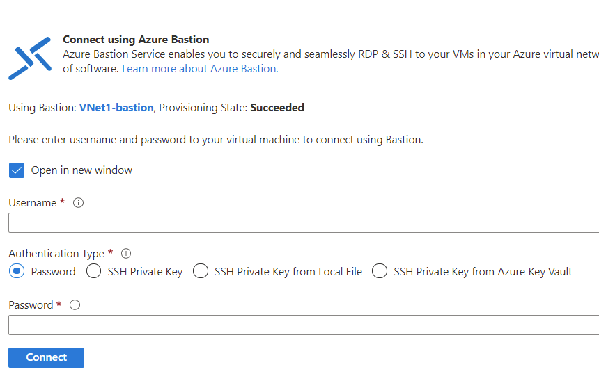

# デモンストレーション: Azure Bastion を使って Linux VM への SSH 接続を作成する

In this demo you will use the Azure portal and your username and password to create an SSH connection to a Linux VM located in an Azure virtual network. When you use Azure Bastion, your VMs don't require a client, agent, or additional software.

## 前提条件

To complete this demo, you will require an Azure virtual network containing a Linux VM. For more information about how to create an Azure VM, see <bpt id="p1">[</bpt>Demonstration: Create a virtual machine in the portal<ept id="p1">](https://github.com/MicrosoftLearning/AZ-120-Planning-and-Administering-Microsoft-Azure-for-SAP-Workloads/blob/master/Demos/demo-create-virtual-machine-portal.md)</ept>, or <bpt id="p2">[</bpt>Demonstration: Create a virtual machine with PowerShell<ept id="p2">](https://github.com/MicrosoftLearning/AZ-120-Planning-and-Administering-Microsoft-Azure-for-SAP-Workloads/blob/master/Demos/demo-create-virtual-machine-powershell.md)</ept>.

このデモでは、Azure portal とユーザー名とパスワードを使用して、Azure 仮想ネットワークにある Linux VM への SSH 接続を作成します。 

### 必要なロール

接続を作成するには、次のロールが必要です。

* 仮想マシンに対する閲覧者ロール
* 仮想マシンのプライベート IP を使用する NIC に対する閲覧者ロール
* Azure Bastion リソースに対する閲覧者ロール

### Port

SSH 経由で Linux VM に接続するには、お使いの VM で次のポートを開いておく必要があります。

* 受信ポート: SSH (22) ***または***
* 受信ポート: カスタム値 (Azure Bastion 経由で VM に接続するときに、このカスタム ポートを指定する必要がある)

> Azure Bastion を使用する場合、VM にクライアント、エージェント、追加のソフトウェアは不要です。

## 接続: ユーザー名とパスワードを使用する

1. Open the <bpt id="p1">[</bpt>Azure portal<ept id="p1">](https://portal.azure.com)</ept>. Navigate to the virtual machine that you want to connect to, select <bpt id="p1">**</bpt>Connect<ept id="p1">**</ept>, and then select <bpt id="p2">**</bpt>Bastion<ept id="p2">**</ept> from the dropdown.

    ![Azure portal の仮想マシンの概要を示すスクリーンショット。[接続] が選ばれています。](Images/azure-bastion-connect.png)

1. Select <bpt id="p1">**</bpt>Use Bastion<ept id="p1">**</ept>. If you didn't provision Bastion for the virtual network, see <bpt id="p1">[</bpt>Configure Bastion<ept id="p1">](https://docs.microsoft.com/azure/bastion/quickstart-host-portal)</ept>.
1. **[Azure Bastion を使用して接続する]** ページで、 **[ユーザー名]** と **[パスワード]** を入力します。

    

1. **[接続]** を選択して VM に接続します。