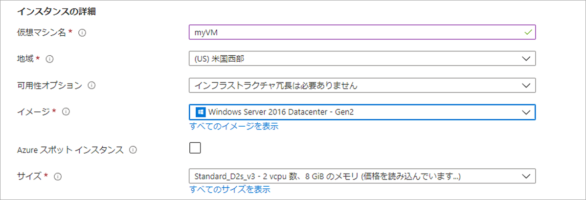
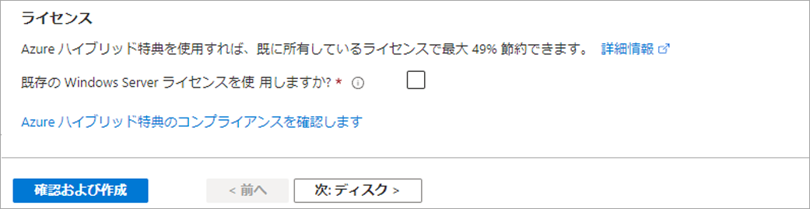

# デモ: ポータルで仮想マシンを作成する

このデモでは、ポータルに Windows 仮想マシンを作成してアクセスします。

## 仮想マシンを作成する

1. Azure Portal の左上隅にある 「**リソースの作成**」 を選択します。
2. Azure Marketplace リソースの一覧の上にある検索ボックスで、**Windows Server 2016 Datacenter** を検索します。イメージを見つけたら、「**作成**」 をクリックします。
3. 「**基本**」 タブの 「**プロジェクトの詳細**」 に、正しいサブスクリプションが選択されていることを確認し、「**新しいリソース グループの作成**」 を選択します。名前に *myResourceGroup* を入力します。

    

4. 「**インスタンスの詳細**」の 「**仮想マシン名**」 に「*myVM*」を入力し、**場所**として 「*米国東部*」 を選択します。他の既定値をそのままにします。

    

5. 「**管理者アカウント**」 に、*azureuser* などのユーザー名とパスワードを指定します。パスワードの長さは 12 文字以内で、定義された複雑さの要件を満たす必要があります。

    

6. **受信ポートの規則** で、**選択したポートを許可します**を選択し、ドロップダウンから **RDP (3389)** と **HTTP** を選択します。

    

7. **管理** タブに移動し、**監視** の下で「ブート診断を **オフ** にする」 をクリックします。これにより、検証エラーが解消されます。 
8. 残りの既定値をそのままにして、ページの下部にある 「**Review + create**」 ボタンを選択します。検証を待ってから、「**作成**」 をクリックします。 

    

## 仮想マシンに接続する

仮想マシンへのリモート デスクトップ接続を作成します。これらの方法により、Windows コンピューターから VM に接続する方法がわかります。Mac では、Mac App Store から RDP クライアントをインストールする必要があります。

1. 仮想マシンのプロパティ ページで 「**接続**」 ボタンを選択します。
2. 「**仮想マシンに接続**」 ページで、ポート 3389 経由で DNS 名で接続する既定のオプションを保持し、「**RDP ファイルのダウンロード**」 をクリックします。
3. ダウンロードした RDP ファイルを開き、プロンプトが表示されたときに 「**接続**」 を選択します。
4. 「**Windows セキュリティ**」 ウィンドウで 「**その他**」 を選択し、「**別のアカウントを使用する**」 を選択します。localhost\username としてユーザー名を入力して、仮想マシン用に作成したパスワードを入力し 「**OK**」 を選択します。
5. サインイン プロセス中に証明書の警告が表示されることがあります。「**はい**」 または 「**続行**」 を選択して接続を作成します。

## Web サーバーのインストール

VM の操作を確認するには、IIS Web サーバーをインストールします。VM で PowerShell プロンプトを開き、次のコマンドを実行します。

```PowerShell
Install-WindowsFeature -name Web-Server -IncludeManagementTools
```

完了したら、VM への RDP 接続を閉じます。

## IIS のウェルカム ページを表示する

portal にVM を選択し、VM の概要ウィンドウに Public IP Addresses の右側にある 「**コピーへクリック**」 ボタンを使用してコピーし、ブラウザー タブに貼り付けます。既定の IIS ウェルカム ページが開きます。


## リソースをクリーン アップする

>**注:** 不要になった場合は、リソース グループ、仮想マシン、およびすべての関連リソースを削除できます。これを行うには、仮想マシンのリソース グループを選択し、**削除** を選択 し、削除するリソース グループの名前を確認します。
