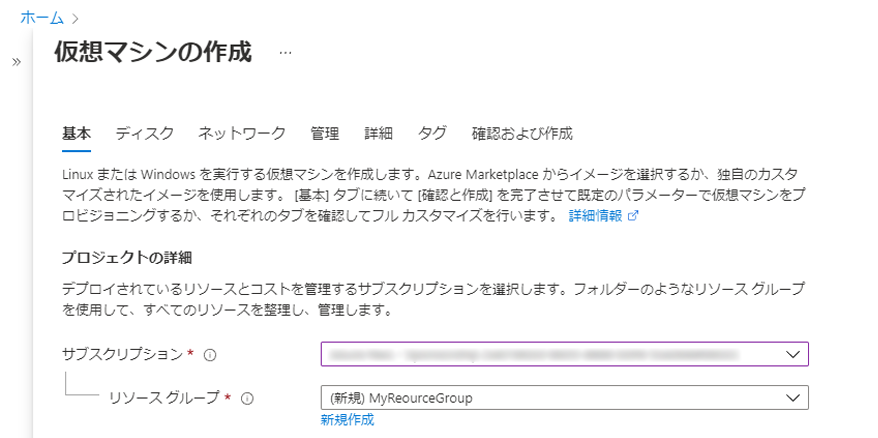
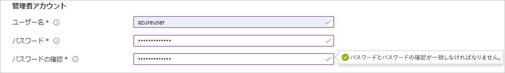
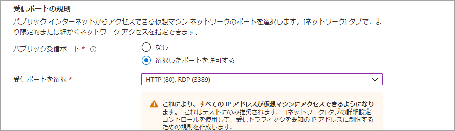
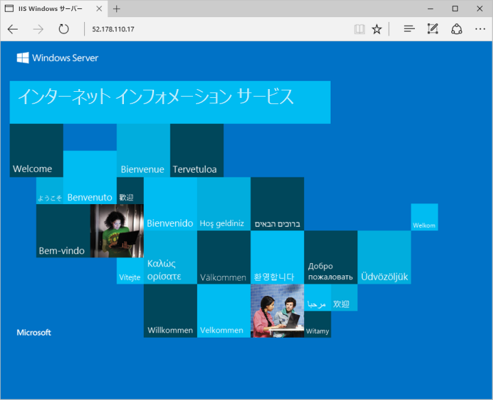

# <a name="demonstration-create-a-virtual-machine-in-the-portal"></a>デモンストレーション: ポータルで仮想マシンを作成する

このデモでは、Azure portal で Windows 仮想マシンを作成してアクセスします。

## <a name="create-the-virtual-machine"></a>仮想マシンの作成

1. Azure portal の左上隅にある **[リソースの作成]** を選択します。
2. Azure Marketplace リソースの一覧の上にある検索ボックスで、**Windows Server 2016 Datacenter** を検索します。 イメージを見つけたら、 **[作成]** をクリックします。
3. **[基本]** タブの **[Project details] (プロジェクトの詳細)** で、正しいサブスクリプションが選択されていることを確認し、リソース グループの **[新規作成]** を選択します。 名前として「*myResourceGroup*」と入力します。

    

4. **[インスタンスの詳細]** で、**[仮想マシン名]** として「*myVM*」と入力し、**[場所]** として *[米国東部]* を選択します。 他の既定値はそのままにします。

    ![[Instance details] (インスタンスの詳細) セクション](Images/AZ103_Demo_Creating_VMs2.png)

5. **[管理者アカウント]** で、ユーザー名 (*azureuser* など) とパスワードを指定します。 パスワードは 12 文字以上で、定義された複雑さの要件を満たす必要があります。

    

6. **[受信ポートの規則]** で、**[Allow selected ports] (選択されたポートを許可する)** を選択してから、ドロップダウンから **[RDP (3389)]** と **[HTTP]** を選択します。

    

7. **[管理]** タブに移動し、 **[監視]** の下でブート診断を **[オフ]** にします。 これにより、検証エラーが解消されます。 
8. 残りの既定値はそのままにして、ページの一番下にある **[Review + create] (確認および作成)** ボタンを選択します。 検証を待ってから、 **[作成]** をクリックします。 

    ![[Review and create] (確認および作成)](Images/AZ103_Demo_Creating_VMs5.png)

## <a name="connect-to-the-virtual-machine"></a>仮想マシンへの接続

仮想マシンへのリモート デスクトップ接続を作成します。 この手順では、Windows コンピューターから、VM に接続する方法を示します。 Mac では、Mac App Store から RDP クライアントをインストールする必要があります。

1. 仮想マシンのプロパティ ページで **[接続]** ボタンを選択します。
2. **[Connect to virtual machine]\(仮想マシンへの接続\)** ページで、ポート 3389 を介して DNS 名で接続する既定のオプションをそのまま使用して、**[RDP ファイルのダウンロード]** をクリックします。
3. ダウンロードした RDP ファイルを開き、プロンプトが表示されたら **[接続]** を選択します。
4. **[Windows セキュリティ]** ウィンドウで、 **[その他]** 、 **[別のアカウントを使用する]** の順に選択します。 ユーザー名を localhost\username として入力し、仮想マシン用に作成したパスワードを入力して **[OK]** を選択します。
5. サインイン処理中に証明書の警告が表示される場合があります。 **[はい]** または **[続行]** を選択して接続を作成します。

## <a name="install-web-server"></a>Web サーバーのインストール

VM の操作を確認するには、IIS Web サーバーをインストールします。 VM で PowerShell プロンプトを開き、次のコマンドを実行します。

```PowerShell
Install-WindowsFeature -name Web-Server -IncludeManagementTools
```

終了したら、VM への RDP 接続を閉じます。

## <a name="view-the-iis-welcome-page"></a>IIS のようこそページの表示

portal にVM を選択し、VM の概要ウィンドウに Public IP Addresses の右側にある **[コピーへクリック]** ボタンを使用してコピーし、ブラウザー タブに貼り付けます。既定の IIS ウェルカム ページが開きます。



## <a name="clean-up-resources"></a>リソースをクリーンアップする

>**注:**  不要になった場合は、リソース グループ、仮想マシン、およびすべての関連リソースを削除できます。 これを行うには、仮想マシンのリソース グループを選択し、 **[削除]** を選択して、削除するリソース グループの名前を確認します。