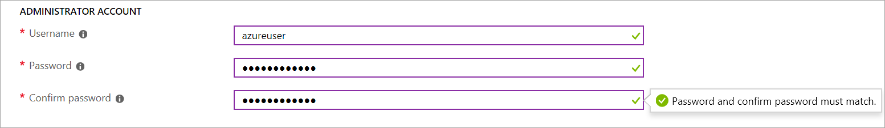

# <a name="demonstration-create-a-virtual-machine-in-the-portal"></a>デモンストレーション: ポータルで仮想マシンを作成する

このデモでは、Azure portal で Windows 仮想マシンを作成してアクセスします。

## <a name="create-the-virtual-machine"></a>仮想マシンの作成

1. Azure portal の左上隅にある **[リソースの作成]** を選択します。
2. In the search box above the list of Azure Marketplace resources, search for <bpt id="p1">**</bpt>Windows Server 2016 Datacenter<ept id="p1">**</ept>. After locating the image, click <bpt id="p1">**</bpt>Create<ept id="p1">**</ept>.
3. In the <bpt id="p1">**</bpt>Basics<ept id="p1">**</ept> tab, under <bpt id="p2">**</bpt>Project details<ept id="p2">**</ept>, make sure the correct subscription is selected and then choose to <bpt id="p3">**</bpt>Create new<ept id="p3">**</ept> resource group. Type <bpt id="p1">*</bpt>myResourceGroup<ept id="p1">*</ept> for the name.

    

4. Under <bpt id="p1">**</bpt>Instance details<ept id="p1">**</ept>, type <bpt id="p2">*</bpt>myVM<ept id="p2">*</ept> for the <bpt id="p3">**</bpt>Virtual machine name<ept id="p3">**</ept> and choose <bpt id="p4">*</bpt>East US<ept id="p4">*</ept> for your <bpt id="p5">**</bpt>Location<ept id="p5">**</ept>. Leave the other defaults.

    ![[Instance details] (インスタンスの詳細) セクション](Images/AZ103_Demo_Creating_VMs2.png)

5. Under <bpt id="p1">**</bpt>Administrator account<ept id="p1">**</ept>, provide a username, such as <bpt id="p2">*</bpt>azureuser<ept id="p2">*</ept> and a password. The password must be at least 12 characters long and meet the defined complexity requirements.

    

6. **[受信ポートの規則]** で、**[Allow selected ports] (選択されたポートを許可する)** を選択してから、ドロップダウンから **[RDP (3389)]** と **[HTTP]** を選択します。

    

7. Move to the <bpt id="p1">**</bpt>Management<ept id="p1">**</ept> tab, and under <bpt id="p2">**</bpt>Monitoring<ept id="p2">**</ept> turn <bpt id="p3">**</bpt>Off<ept id="p3">**</ept> Boot Diagnostics. This will eliminate validation errors. 
8. Azure Marketplace リソースの一覧の上にある検索ボックスで、**Windows Server 2016 Datacenter** を検索します。 

    ![[Review and create] (確認および作成)](Images/AZ103_Demo_Creating_VMs5.png)

## <a name="connect-to-the-virtual-machine"></a>仮想マシンへの接続

イメージを見つけたら、 **[作成]** をクリックします。

1. 仮想マシンのプロパティ ページで **[接続]** ボタンを選択します。
2. **[Connect to virtual machine]\(仮想マシンへの接続\)** ページで、ポート 3389 を介して DNS 名で接続する既定のオプションをそのまま使用して、**[RDP ファイルのダウンロード]** をクリックします。
3. ダウンロードした RDP ファイルを開き、プロンプトが表示されたら **[接続]** を選択します。
4. In the <bpt id="p1">**</bpt>Windows Security<ept id="p1">**</ept> window, select <bpt id="p2">**</bpt>More choices<ept id="p2">**</ept> and then <bpt id="p3">**</bpt>Use a different account<ept id="p3">**</ept>. Type the username as localhost\username, enter password you created for the virtual machine, and then select <bpt id="p1">**</bpt>OK<ept id="p1">**</ept>.
5. **[基本]** タブの **[Project details] (プロジェクトの詳細)** で、正しいサブスクリプションが選択されていることを確認し、リソース グループの **[新規作成]** を選択します。

## <a name="install-web-server"></a>Web サーバーのインストール

名前として「*myResourceGroup*」と入力します。

```PowerShell
Install-WindowsFeature -name Web-Server -IncludeManagementTools
```

終了したら、VM への RDP 接続を閉じます。

## <a name="view-the-iis-welcome-page"></a>IIS のようこそページの表示

portal にVM を選択し、VM の概要ウィンドウに Public IP Addresses の右側にある **[コピーへクリック]** ボタンを使用してコピーし、ブラウザー タブに貼り付けます。既定の IIS ウェルカム ページが開きます。


## <a name="clean-up-resources"></a>リソースをクリーンアップする

><bpt id="p1">**</bpt>Note:<ept id="p1">**</ept> When no longer needed, you can delete the resource group, virtual machine, and all related resources. To do so, select the resource group for the virtual machine, select <bpt id="p1">**</bpt>Delete<ept id="p1">**</ept>, then confirm the name of the resource group to delete.