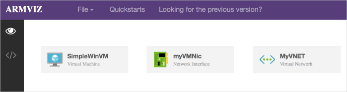
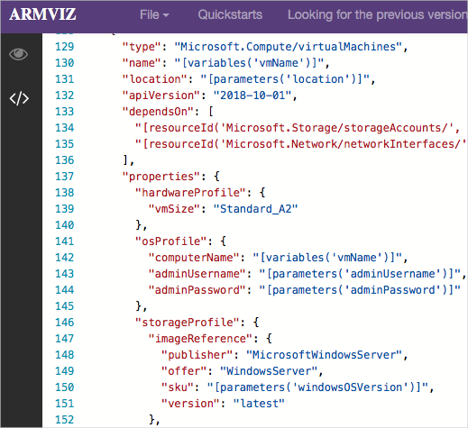

# デモ: クイックスタート テンプレートを確認する

## ギャラリーを確認する

1. 先ず、[Azure クイックスタート テンプレート ギャラリー](https://azure.microsoft.com/resources/templates?azure-portal=true)を参照することから始めることができます。ギャラリーには、人気のあるテンプレートや最近更新されたテンプレートが多数あります。これらのテンプレートは、Azure リソースと一般的なソフトウェア パッケージの両方で動作します。
2. 使用可能なさまざまな種類のテンプレートを参照します。
3. 興味のあるテンプレートはありますか。

## テンプレートを詳しく見る

1. <a href="https://azure.microsoft.com/resources/templates/101-vm-simple-windows?azure-portal=true" target="_blank"><span style="color: #0066cc;" color="#0066cc">「基本の Windows VM をデプロイする」</span></a> というテンプレートを見つけたとします。

    

    >**注:**
    >- 「**Azure にデプロイ**」 ボタンを使用すると、必要に応じて Azure portal から直接テンプレートをデプロイできます。
    >- スクロールダウンして、テンプレート 「**PowerShell**」 コードを使用します。**TemplateURI** が次のデモで必要になります。**値をコピー**します。 

```
https://raw.githubusercontent.com/Azure/azure-quickstart-templates/master/101-vm-simple-windows/azuredeploy.json
```

2. 「**GitHub を参照**」 をクリックして、GitHub のテンプレートのソース コードに移動します。

    

3. このページから **Azure にデプロイ**することもできることに注意してください。Readme ファイルを表示するには、少し時間がかかります。これは、テンプレートがユーザーに適しているかどうかを判断するのに役立ちます。  

4. 「**視覚化**」 をクリックして 「**Azure Resource Manager Visualizer**」 に移動します。

    

5. VM、ストレージ アカウント、ネットワーク リソースなど、デプロイを構成するリソースに注目します。
6. マウスを使用してリソースを配置します。マウスのスクロール ホイールを使用してズーム イン/アウトすることもできます。
7. **SimpleWinVM**というラベルの付いた VM リソースをクリックします。

    

8. VM リソースを定義するソース コードを確認します。

    * リソースのタイプは `Microsoft.Compute/virtualMachines` です。
    * その場所、または Azure リージョンは、`location` という名前のテンプレート パラメーターから来ます。
    * VM のサイズは **Standard_A2** です。
    * コンピューター名はテンプレート変数から読み取られ、VM のユーザー名とパスワードはテンプレート パラメーターから読み取られます。

9. テンプレート内のファイルを表示するクイック スタート ページに戻ります。azuredeploy.json ファイルへのリンクをコピーします。次の形式が必要です。

>**注:** 次のデモでテンプレート リンクが必要になります。
