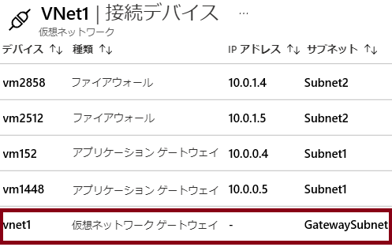

# デモ: VNet 間接続を確認する

> **注**: このデモは、サブネットを使用する 2 つの仮想ネットワークに最適です。すべての手順はポータルにあります。 

## ゲートウェイ サブネット ブレードを確認する

1. 仮想ネットワークのうちの 1 つに、「**サブネット**」 ブレードを選択します。
1. 「**+ ゲートウェイ サブネット**」 を選択します。

    - サブネットの名前は変更できないこと注意してください。  
    - ゲートウェイ サブネットの**アドレスの範囲**に注意してください。アドレスは、仮想ネットワークのアドレス空間に含まれている必要があります。 

1. 各仮想ネットワークにはゲートウェイ サブネットが必要であることに注意してください。 
1. 「ゲートウェイ サブネットの追加」 ページを閉じます。変更を保存する必要はありません。

## 接続されたデバイス ブレードを確認する

1. 仮想ネットワークの場合は、「**接続されたデバイス**」 ブレードを選択します。
2. ゲートウェイ サブネットをデプロイすると、接続されているデバイスのリストに表示されます。

## 仮想ネットワーク ゲートウェイの追加を確認する

1. **仮想ネットワーク ゲートウェイ**を検索します。
2. **+Add**をクリックします。
3. 仮想ネットワーク ゲートウェイの各設定を確認します。
4. 情報アイコンを使用して、設定の詳細を確認します。
5. **ゲートウェイ タイプ**、**VPN タイプ**、**SKU** に注意してください。 
6. **パブリック IP アドレス** が必要なことに注意してください。
7. 各仮想ネットワークには仮想ネットワーク ゲートウェイが必要である 
8. **仮想ネットワーク ゲートウェイの追加**ページを閉じます。変更を保存する必要はありません。 

## 仮想ネットワーク間の接続の追加を確認する

1. **接続**を検索します。
2. **+Add**をクリックします。
3. **接続の種類**はVNetツーVNet、サイト間 (IPsec)、または ExpressRouteになれます。
4. **OK**ボタンをクリックできるように、十分な情報を入力します。
5. **設定**ページに、2 つの異なる仮想ネットワークを選択する必要があることに注意してください。
6. **双方向接続の作成**チェックボックスにヘルプ情報を参照してください。
7. **共有キー (PSK)** 情報にご注意ください。
8. 「**接続の追加**」 ページを閉じます。変更を保存する必要はありません。 
