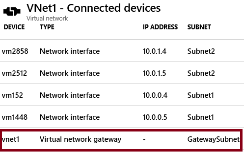

# デモ: VNet から VNet への接続の詳細を確認する

><bpt id="p1">**</bpt>Note<ept id="p1">**</ept>: This demonstration works best with two virtual networks with subnets. All the steps are in the portal. 

## ゲートウェイ サブネット ブレードを詳しく見る

1. 仮想ネットワークのうちの 1 つに、 **[サブネット]** ブレードを選択します。
1. **+ ゲートウェイ サブネット** を選択します。

    - サブネットの名前は変更できないことに注意してください。  
    - Notice the <bpt id="p1">**</bpt>address range<ept id="p1">**</ept> of the gateway subnet. The address must be contained by the address space of the virtual network. 

1. 各仮想ネットワークにはゲートウェイ サブネットが必要であることに注意してください。 
1. **注**:このデモは、サブネットによる 2 つの仮想ネットワークに最適です。

## 接続されたデバイス ブレードを詳しく見る

1. 仮想ネットワークの場合は、 **[接続されたデバイス]** ブレードを選択します。
2. ゲートウェイ サブネットをデプロイすると、接続されているデバイスのリストに表示されます。

## 仮想ネットワーク ゲートウェイの追加を確認する

1. **仮想ネットワーク ゲートウェイ** を検索します。
2. **[+ 追加]** をクリックします。
3. 仮想ネットワーク ゲートウェイの各設定を確認します。
4. 情報アイコンを使用して、設定の詳細を確認します。
5. **ゲートウェイ タイプ**、**VPN タイプ**、**SKU** に注意してください。 
6. **パブリック IP アドレス** が必要なことに注意してください。
7. 各仮想ネットワークには仮想ネットワーク ゲートウェイが必要である 
8. すべての手順はポータルにあります。 

## 仮想ネットワーク間の接続の追加を確認する

1. **接続** を検索します。
2. **[+ 追加]** をクリックします。
3. **接続の種類**は、VNet 間、サイト間 (IPsec)、ExpressRoute にできることに注意してください。
4. **[OK]** ボタンをクリックできるように、十分な情報を入力します。
5. **[設定]** ページで、2 つの異なる仮想ネットワークを選択する必要があることに注意してください。
6. **双方向接続の確立** チェックボックスにヘルプ情報を参照してください。
7. **共有キー (PSK)** 情報に注意してください。
8. Close the <bpt id="p1">**</bpt>Add connection<ept id="p1">**</ept> page. You do not need to save your changes. 